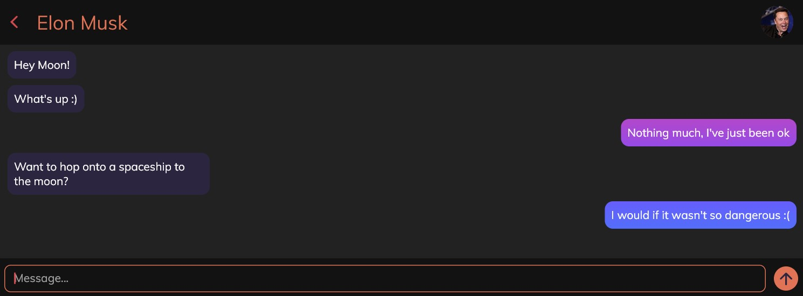

# Gradient Message Bubbles

Check out my YouTube channel! [MOONSDONTBURN](https://www.youtube.com/channel/UCurQRmT17EyOIrdPseiastg)

## Getting Started
These instructions will help you get this project running on your local machine to test out the project.

### Prerequisites
* Flutter ver. 2.0 or higher

### Running the project
After cloning the project or downloading the project, open up `main.dart` in the lib folder and press run the project.

## Thanks 😄
Thank you for checking out the project, stay tuned for more and don't forget to support me on my social media. Supporting me
really makes a difference! I hope to output more quality content and projects to help other Flutter developers pursue more complex
and beautiful designs.

## License
This project is licensed under the MIT License - see the LICENSE.md file for details